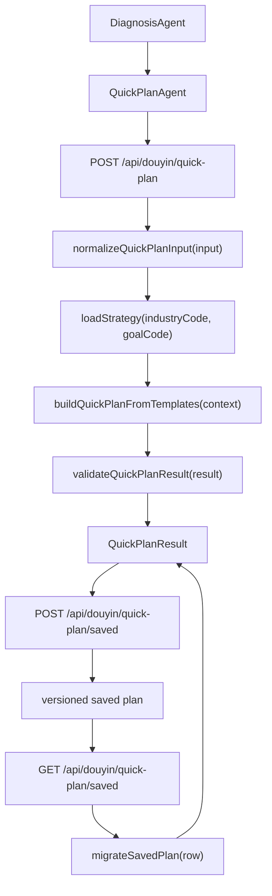

# 抖音 15 天计划链路重构设计

Feature Name: quick-plan-refactor
Updated: 2026-07-11

## Description

本设计把抖音体检报告到 15 天计划链路整理为“标准输入 -> 策略配置 -> 日任务模板 -> 结果协议 -> 保存计划版本化 -> 语义验收”的稳定闭环。核心收益是降低 `douyinAgents.js` 中业务规则耦合度，统一前后端归一化口径，并让餐饮、美业、教培三行业的输出可通过自动化测试持续验证。

## Current Problems

- 前后端各维护一份 `normalizeIndustryCode()`，行业别名新增时容易出现一端遗漏。
- `buildQuickPlanFallback()` 同时负责输入归一、行业素材、目标命名、调研字段融合、日任务脚本、风险边界和兼容字段，函数职责过重。
- 行业词、目标词、CTA、指标、镜头、证明素材和合规边界散落在生成函数内部，跨行业串词需要靠人工发现。
- AI 生成和规则生成依赖同一前端展示，但协议校验和缺字段补齐缺少独立层。
- 保存计划只保存最近一份，旧结构通过读取时补齐；缺少版本、输入摘要和迁移标记。
- 前端还保留默认展示派生规则，后端协议变化时容易产生新的展示差异。
- 现有测试偏接口可用和页面可见，语义层面对行业禁用词、脚本唯一性、旧计划迁移和体检上下文覆盖不足。

## Architecture



### Runtime Flow

1. `DiagnosisAgent.vue` 继续收集 9 个顾问追问和经营数据，并把字段传入 `QuickPlanAgent.vue`。
2. `QuickPlanAgent.vue` 只负责表单状态、请求、卡片展示、保存和复盘跳转。
3. `/api/douyin/quick-plan` 先调用 `normalizeQuickPlanInput()`，把行业、目标、诊断上下文和默认值整理为标准计划输入。
4. 规则生成路径调用 `buildQuickPlanFromTemplates()`，AI 生成路径调用 `generateStructured()` 后进入同一校验补齐函数。
5. `validateQuickPlanResult()` 输出统一的 QuickPlanResult。
6. 保存计划写入 `planVersion` 和 `inputHash`。
7. 读取旧计划时调用 `migrateSavedPlan()` 生成展示对象，并保留已有 day status。

## Components and Interfaces

### Backend Modules

- `backend/src/routes/douyinAgents.js`
  - 保留 Express 路由、鉴权、请求响应和数据库读写。
  - 调用新增纯函数模块生成和迁移计划。

- `backend/src/services/douyin/quickPlanInput.js`
  - 导出 `normalizeIndustryCode()`、`normalizeGoalCode()`、`normalizeQuickPlanInput()` 和 `createQuickPlanInputHash()`。
  - 作为前端可复用常量的后端源头。

- `backend/src/services/douyin/quickPlanStrategies.js`
  - 导出 `industryStrategies` 和 `goalStrategies`。
  - 集中维护行业术语、默认产品、客户顾虑、证明素材、转化指标、行动入口、合规边界和禁用词。

- `backend/src/services/douyin/quickPlanTemplates.js`
  - 导出 Day 1 到 Day 15 的日任务模板。
  - 模板只描述执行意图和字段组合方式，行业术语从策略包注入。

- `backend/src/services/douyin/quickPlanGenerator.js`
  - 导出 `buildQuickPlanFromTemplates()` 和 `validateQuickPlanResult()`。
  - 负责生成完整 15 天计划、补齐兼容字段和返回 meta。

- `backend/src/services/douyin/quickPlanMigration.js`
  - 导出 `migrateSavedPlan()`。
  - 负责旧计划补齐、版本升级和执行状态保留。

### Frontend Modules

- `frontend/src/views/douyin/DiagnosisAgent.vue`
  - 保持体检输入流程。
  - 输出字段名称与标准计划输入保持一致。

- `frontend/src/views/douyin/QuickPlanAgent.vue`
  - 移除重复行业归一化别名表，改用轻量映射或后端返回值校准页面状态。
  - 展示 QuickPlanResult 的主字段，兼容字段只作为旧数据兜底。

- `frontend/src/constants/douyinQuickPlan.js`
  - 提供行业和目标下拉选项、状态选项、字段标签。
  - 保持展示常量和生成规则分离。

## Data Models

### StandardQuickPlanInput

```json
{
  "industryCode": "restaurant",
  "goalCode": "conversion",
  "mode": "group-buy",
  "frequency": 1,
  "adSupport": "no",
  "diagnosisContext": {
    "source": "diagnosis",
    "weakness": "conversion",
    "profile": "低播放冷启动型",
    "confidence": "高",
    "metrics": "weeklyPosts:2;avgViewsPerVideo:300;monthlyInquiries:5;monthlyConversions:1",
    "bottleneck": "视频有人看但没人买团购，私信也很少",
    "currentAction": "每周发2条探店视频，偶尔投200元本地推",
    "targetAudience": "周边3公里宝妈和午餐白领",
    "coreOffer": "98元双人午餐套餐",
    "offerPrice": "98元含招牌菜、主食和两杯饮品，仅工作日午市可用",
    "userObjection": "怕分量少、到店排队、停车不方便",
    "proofAssets": "后厨出餐过程、真实分量对比、老客评价截图",
    "conversionPath": "点主页团购券或私信发送午餐",
    "painSummary": "转化链路偏弱"
  }
}
```

### QuickPlanResult

```json
{
  "title": "餐饮行业 15 天团购核销速胜计划",
  "summary": "围绕98元双人午餐套餐，先验证内容方向，再放大有效视频，最后承接到团购核销。",
  "researchBrief": ["目标客户：周边3公里宝妈和午餐白领"],
  "riskBoundary": ["数据复盘边界", "投流放量边界", "行业合规边界"],
  "phases": [
    {
      "name": "测试期",
      "days": [
        {
          "day": 1,
          "phase": "测试期",
          "goal": "验证主推套餐的避坑选题",
          "action": "验证主推套餐的避坑选题",
          "workType": "测试内容",
          "videoFunction": "同城拉新",
          "shootingMethod": "老板口播 + 门店画面",
          "topicDirection": "98元双人午餐套餐的3个避坑点",
          "content": "98元双人午餐套餐的3个避坑点",
          "executionTool": "脚本生成器 / 标题优化器",
          "adPlan": "自然流量测试",
          "ad": "自然流量测试",
          "customerNurture": "评论区答疑并引导主页团购券",
          "reviewMetrics": "播放、完播、评论、私信和核销",
          "kpi": "播放、完播、评论、私信和核销",
          "shootingScript": {
            "hook": "开头文案",
            "shots": ["镜头1", "镜头2", "镜头3", "镜头4"],
            "talkingPoints": ["要点1", "要点2", "要点3"],
            "voiceover": "可照读口播",
            "cta": "行动引导",
            "duration": "30-45 秒"
          },
          "status": "进行中"
        }
      ]
    }
  ],
  "meta": {
    "planVersion": 2,
    "generationMode": "rule",
    "industryCode": "restaurant",
    "goalCode": "conversion",
    "inputHash": "sha256-short",
    "migrated": false
  }
}
```

### Saved Plan Row Extension

优先采用兼容迁移方式扩展 `douyin_quick_plans`：

- `plan_version`：整数，默认 1，新生成计划写入当前版本。
- `input_hash`：字符串，用于判断当前体检上下文与保存计划是否一致。
- `diagnosis_context`：继续保存标准化后的诊断上下文。
- `plan`：继续保存 QuickPlanResult。

## Correctness Properties

- 每个 QuickPlanResult 恰好包含 3 个阶段和 15 个 day 项。
- 每个 day 项必须拥有完整展示字段和兼容字段。
- 每个 shootingScript 必须拥有 4 条 shots。
- 同一计划内 Day 1 到 Day 15 的 hook、shots 和 cta 应具备日级差异。
- 行业策略包的禁用词不得出现在其他行业输出中。
- 保存计划迁移必须保留 day.status。
- 从体检报告进入计划页时，当前诊断上下文优先生成新计划。
- 手动读取保存计划时，保存计划优先展示。

## Error Handling

- 输入解析失败：返回 400，错误信息说明缺失字段或非法字段。
- AI 输出解析失败：返回规则生成结果，`meta.generationMode` 设置为 `ruleFallback`。
- 旧计划迁移失败：返回原始保存计划可展示部分，并提示重新生成计划。
- 保存计划失败：返回 500，前端保留当前未保存计划并显示保存失败提示。
- 状态更新失败：前端回滚当前 day 状态并显示失败提示。

## Test Strategy

### Unit Tests

- `normalizeIndustryCode()` 覆盖 restaurant、餐饮、美业、医美、education、教培、service 等别名。
- `normalizeGoalCode()` 覆盖显式目标和 weakness 推导。
- `buildQuickPlanFromTemplates()` 覆盖 3 行业和 3 目标组合。
- `validateQuickPlanResult()` 覆盖缺字段补齐、shots 长度、兼容字段补齐。
- `migrateSavedPlan()` 覆盖旧计划缺 shootingScript、缺 riskBoundary、缺 researchBrief 和状态保留。

### Integration Tests

- `POST /api/douyin/quick-plan` 验证诊断上下文生成路径。
- `POST /api/douyin/quick-plan` 验证手动 AI 路径降级后的协议一致性。
- `POST /api/douyin/quick-plan/saved` 验证保存 planVersion 和 inputHash。
- `GET /api/douyin/quick-plan/saved` 验证旧计划迁移展示对象。
- `PATCH /api/douyin/quick-plan/saved/status` 验证 day status 更新。

### Semantic Matrix

- 餐饮 conversion：命中团购、核销、套餐、到店；检测美业和教培专属词。
- 美业 conversion：命中预约、留资、体验卡、到店；检测后厨、招牌菜、团购券等餐饮专属词。
- 教培 leads：命中试听、测评课、家长反馈、留资；检测餐饮和美业专属词。
- 三行业均断言 `uniqueHooks=15`、`uniqueShots=15`、`uniqueCtas=15`。
- 三行业均断言 deep research 字段进入 Day 1 到 Day 15 的不同任务。

### Browser Tests

- 从 `/douyin/diagnosis` 填写完整调研字段并跳转 `/douyin/quick-plan`。
- 验证页面存在 15 个 day card、15 个 script panel、researchBrief 和 riskBoundary。
- 验证体检入口自动生成的当前上下文拥有展示优先级，手动读取保存计划后展示保存内容。
- 验证状态更新后刷新页面仍保留 day.status。

## Migration Plan

1. 新增纯函数模块和测试，保持现有路由响应字段兼容。
2. 将 `buildQuickPlanFallback()` 内的行业策略、目标策略和日任务模板迁出。
3. 在 `/api/douyin/quick-plan` 接入标准输入和结果校验。
4. 扩展保存计划版本字段，并让读取接口支持旧数据迁移。
5. 精简 `QuickPlanAgent.vue` 的展示兜底逻辑。
6. 补齐语义验收矩阵和浏览器验收。
7. 构建通过后按线上备份流程部署，并保留回滚包。

## Rollback Strategy

- 保留旧 `buildQuickPlanFallback()` 的接口兼容输出直到新测试矩阵稳定。
- 发布前备份线上 `backend/src/routes/douyinAgents.js`、新增服务模块和 `frontend/dist`。
- 数据库新增字段采用可空或默认值，旧代码保持原读取路径。
- 若线上计划生成异常，回滚后端文件和前端构建产物，保存计划 JSON 仍可被旧读取逻辑解析。

## References

- `.monkeycode/docs/ARCHITECTURE.md`：抖音样板链路和数据表说明。
- `backend/src/routes/douyinAgents.js`：当前 QuickPlan 路由、规则生成、保存计划和复盘记录逻辑。
- `frontend/src/views/douyin/DiagnosisAgent.vue`：当前体检输入和调研字段来源。
- `frontend/src/views/douyin/QuickPlanAgent.vue`：当前 15 天计划展示、保存和复盘入口。
