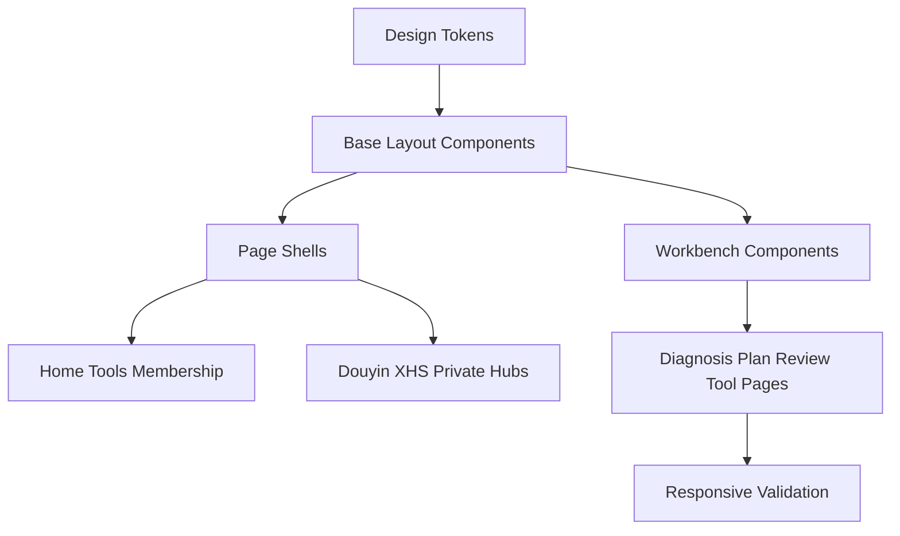

# 全站设计排版系统重构

Feature Name: site-layout-system-refactor
Updated: 2026-07-13

## Description

本设计将我赢AI前端从页面级零散排版收口为统一的工作台式布局系统。重构覆盖首页、工具页、会员页、抖音/小红书/私域 Hub、诊断、计划、复盘和主要工具结果页。业务内容保持当前经营闭环方向，前端重点调整视觉层级、页面框架、卡片密度、导航定位、响应式规则和可复用组件。

截图暴露的主要问题包括：长文本依据集中在单一卡片中、每日任务三栏卡片过窄、状态和主标题争抢视觉焦点、工具操作区层级不清、桌面空白与内容拥挤并存、移动端三栏结构存在崩溃风险。重构以“任务、指标、行动入口、复盘结果”为界面组织原则。

## Architecture



前端继续使用 Vue 3、Vue Router、Pinia 和 Vite。重构优先在 `frontend/src/styles/variables.css`、`frontend/src/styles/main.css` 和少量共享组件中建立基础规范，再按页面类型逐步替换页面内重复样式。业务请求、路由权限、会员判断和后端接口保持现状。

## Components and Interfaces

### Design Tokens

- 文件：`frontend/src/styles/variables.css`。
- 扩展颜色令牌：主色、中性色、状态色、信息色、工作台背景、卡片背景、弱边框。
- 扩展布局令牌：桌面内容宽度、工作台宽度、三栏栅格、双栏栅格、移动端间距。
- 扩展组件令牌：按钮高度、卡片圆角、卡片内边距、标签高度、表单高度、模块间距。
- 对应需求：Requirement 2.1、2.4、5.1、5.2、5.3、6.2。

### Base Layout Components

- `AppShell` 或基础 CSS 类：提供页面级背景、内容容器、顶部标题区和区块间距。
- `PageHeader`：统一页面任务标题、说明、主操作和辅助状态。
- `SectionHeader`：统一模块标题、说明和右侧操作。
- `WorkbenchGrid`：提供桌面三栏、平板两栏、移动单列布局。
- `ActionPanel`：统一主按钮、次按钮、工具入口和保存/复盘操作。
- 对应需求：Requirement 1.1、1.2、3.2、4.4、6.1、6.3。

### Workbench Components

- `MetricCard`：展示播放、咨询、成交、ROI、执行天数等指标。
- `TaskCard`：展示单个任务、状态、阶段、执行工具和复盘入口。
- `KeyValueList`：展示调研依据、诊断上下文和配置字段。
- `StatusBadge`：统一未开始、进行中、已完成、已复盘、锁定和升级状态。
- `SegmentTabs`：统一脚本/标题、阶段切换、筛选等分段控制。
- 对应需求：Requirement 1.3、2.2、2.3、4.1、4.2、4.3、6.1。

### Page Refactor Targets

- `frontend/src/views/Home.vue`：从营销式首屏收敛为经营工作台入口，保留三主任务入口和作战表示例。
- `frontend/src/views/Tools.vue`：统一筛选区、数据表卡片和工具入口卡片的密度。
- `frontend/src/views/Membership.vue`：首屏保持经营结果权益表达，权限表改为可扫描的矩阵区域。
- `frontend/src/views/DouyinAgentHub.vue`、`XhsAgentHub.vue`、`PrivateAgentHub.vue`：统一 Hub 的“体检 -> 计划 -> 执行 -> 复盘”四段工作台结构。
- `frontend/src/views/douyin/DiagnosisAgent.vue`：统一体检输入、报告摘要、诊断依据和推荐动作布局。
- `frontend/src/views/douyin/QuickPlanAgent.vue`：重构每日任务卡，避免窄列文本挤压。
- `frontend/src/views/douyin/VideoDiagnoserAgent.vue`：重构复盘输入和结果工作台。
- 通用工具详情页和表格页：逐步接入统一页面标题、表单、结果区和操作面板样式。
- 对应需求：Requirement 1.1、1.2、3.1、3.2、4.1、4.2、4.3。

## Data Models

本重构不新增后端数据模型。前端可新增展示配置对象：

```ts
type PageAction = {
  label: string
  route?: string
  variant: 'primary' | 'secondary' | 'ghost'
  disabled?: boolean
}

type WorkbenchSection = {
  id: string
  title: string
  description?: string
  anchorLabel?: string
  priority: 'primary' | 'secondary'
}

type StatusTone = 'neutral' | 'active' | 'success' | 'warning' | 'danger' | 'locked'
```

这些类型可以先用 JavaScript 常量表达，后续如项目引入 TypeScript 再迁移为显式类型。

## Correctness Properties

1. **Property P1 - 页面框架一致性**: 每个纳入重构的主页面都包含页面标题区、主内容容器和至少一个可识别主操作。对应 Requirement 1.1、1.4。
2. **Property P2 - 响应式宽度稳定性**: 在 375px、768px、1200px 三个断点下，页面级容器不产生横向溢出。对应 Requirement 5.1、5.2、5.3、5.4。
3. **Property P3 - 卡片文本可读性**: 任务卡和指标卡中的中文长文本不被窄列强制逐字换行。对应 Requirement 2.2、4.1。
4. **Property P4 - 操作层级唯一性**: 每个页面区块最多只有一个主按钮，同区块次级操作使用次按钮或文本入口。对应 Requirement 4.4。
5. **Property P5 - 状态表达一致性**: 相同业务状态在不同页面使用同一状态样式或同一共享组件。对应 Requirement 1.3、6.3。
6. **Property P6 - 业务链路保真**: 重构后核心路由、鉴权、会员跳转和 API 请求路径保持当前行为。对应 Requirement 3.1、6.3。

## Error Handling

- 共享组件应允许空标题、空说明、空操作数组和空指标数组，页面在数据缺失时展示已有错误提示或空状态。
- 响应式布局应通过 CSS grid、flex wrap、minmax 和容器内滚动处理极端长文本。
- 页面重构过程中保留现有接口错误展示，例如 `errorMessage`、`upgradeHint`、`saveMessage`。
- 若页面缺少可迁移字段，优先保持现有展示逻辑，再接入共享组件。

## Test Strategy

- 运行 `cd frontend && npm run build` 验证生产构建。
- 增加静态结构测试脚本，检查核心页面包含统一布局锚点、主操作和关键工作台区块。
- 增加响应式属性测试或 Playwright 截图测试，覆盖 375px、768px、1200px 断点的横向溢出和关键元素可见性。
- 对 QuickPlan、VideoDiagnoser、Diagnosis 等高风险页面保留现有结构测试，并扩展工作台布局断言。

## References

[^1]: `.monkeycode/docs/INDEX.md` - 项目概览和核心业务模块。
[^2]: `.monkeycode/docs/ARCHITECTURE.md` - Vue 前端架构、路由和部署形态。
[^3]: `.monkeycode/docs/模块/Frontend.md` - 前端模块、主要页面和构建验证方式。
[^4]: `.monkeycode/specs/site-business-ops-refactor/requirements.md` - 整站经营闭环重构需求。
[^5]: `.monkeycode/specs/site-business-ops-refactor/design.md` - 整站经营闭环重构设计。
[^6]: 用户提供的两张线上页面截图 - 暴露调研依据页和 15 天计划每日任务页的排版问题。
